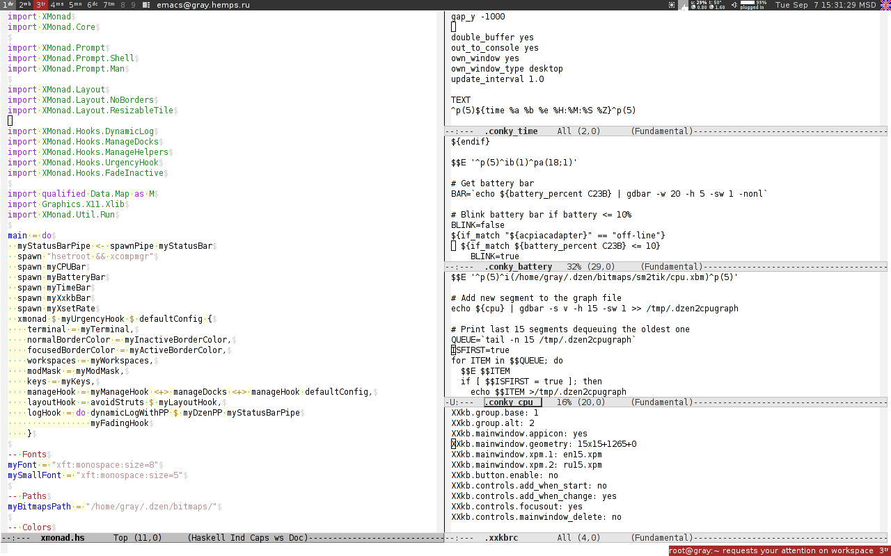

# Xmonad Configuration

I'm no longer a user of Xmonad, but hope you will find my
configuration useful.

## Features

- Dzen plus Conky config using Dzen icons
- resizable tall
- Xmonad shell prompt
- urgency popup
- status bar formatting
- Xxkb keyboard indicator.

## Screenshot

